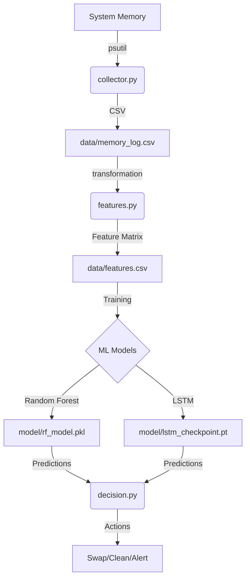

# Project Overview: AI-Based Memory Usage Forecaster

The **AI-Based Memory Usage Forecaster** is a machine-learning-powered system designed to predict future system memory usage and enable proactive memory management. Instead of reacting to low-memory conditions (e.g., waiting for the OOM killer), this system forecasts usage spikes and suggests early interventions.

---

## 🏗️ Architecture & Component Breakdown

The system is modular, following a classic data pipeline: **Collection → Engineering → Prediction → Decision**.

### 1. Data Collection (`collector.py`)
- **Role**: Periodically polls the system for memory metrics and process statistics.
- **Metrics**: 
    - System-wide: `used_mb`, `avail_mb`, `mem_pct`.
    - Process-specific: Top 5 processes (PID, Name, RSS Memory, CPU usage).
- **Output**: Appends data to `data/memory_log.csv` every 2 seconds.

### 2. Feature Engineering (`features.py`)
- **Role**: Transforms raw time-series data into a format suitable for Machine Learning.
- **Engineered Features**:
    - **Lag Features**: Usage from 1, 5, and 10 steps ago.
    - **Rolling Statistics**: Mean, Std Dev, Min, and Max over a 30-step window.
    - **Rate of Change**: MB/sec growth to capture rapid spikes.
    - **Process Context**: Memory footprints of top processes to aid the model in understanding "who" is responsible for consumption.
- **Target (`y`)**: Predicts memory usage **10 steps (20 seconds)** into the future.

### 3. Forecasting Models (`model/`)
The system employs two distinct approaches for comparison:
- **Random Forest (`rf_model.py`)**: A robust baseline that handles non-linear relationships and provides "Feature Importance" scores.
- **LSTM (`lstm_model.py`)**: A Long Short-Term Memory neural network (PyTorch) specifically designed for sequence prediction, capturing long-term dependencies in memory patterns.

### 4. Decision Engine (`decision.py` & `simulate.py`)
- **Role**: Translates ML predictions into actionable system events.
- **Actions**:
    - **Normal**: No action needed.
    - **Warning**: High usage predicted; suggests closing background tabs.
    - **Critical**: Spikes predicted; suggests pre-allocating swap or killing high-RSS processes.
- **Simulation**: Replays historical log data through the models to see how the decision engine would have reacted.

---

## 📈 Data Flow



---

## 🛠️ Technical Stack

- **Languge**: Python 3.x
- **System Metrics**: `psutil`
- **Data Manipulation**: `pandas`, `numpy`
- **Machine Learning**: `scikit-learn` (Random Forest)
- **Deep Learning**: `PyTorch` (LSTM)
- **Serialization**: `joblib`, `pickle`, `torch.save`
- **Visualization**: `matplotlib`

---

## 🚀 How to Run Locally

### 1. Prerequisites
Ensure you have Python 3 installed. You'll need the following libraries:
```bash
pip install psutil pandas numpy scikit-learn torch matplotlib joblib
```

### 2. Quick Start (Synthetic Data)
If you don't want to wait hours for real data collection, run the generator:
```bash
python memory-forecaster/generate_test_data.py
```

### 3. Feature Engineering
Process the raw logs into a feature matrix:
```bash
python memory-forecaster/main.py --mode features
```

### 4. Training & Evaluation
Train both models and generate a comparison report:
```bash
python memory-forecaster/main.py --mode evaluate
```

### 5. Prediction Simulation
See the decision engine in action:
```bash
python memory-forecaster/main.py --mode simulate
```

---

## 📊 Interpreting Results
- **MAE (Mean Absolute Error)**: Average error in Megabytes. Lower is better.
- **MAPE**: Percentage error relative to total usage.
- **Plots**: 
    - `rf_results.png`: Visual overlay of actual vs. predicted (Random Forest).
    - `model_comparison.png`: Comparison of both model performances.
